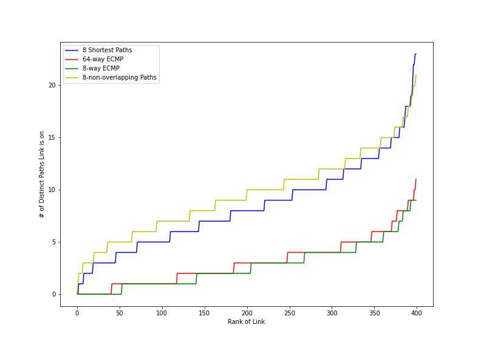

# Non-overlapping Path Algorithm 

## Motivation
The high capacity mentioned in the [Jellyfish paper](https://www.usenix.org/system/files/conference/nsdi12/nsdi12-final82.pdf) inspires us to explore its potential to tackle burst flow. We want to maximize the average throughput at the expense of tolerable latency.

## Progress

We put forward and implemented a new routing algorithm named **Non-overlapping Path**, which guarantees all links on paths from A to B have no overlapping.

This repository implements and tests non-overlapping path algorithm in Jellyfish Network.

## Path Diversity

Jellyfish network with 246 switches (11 for peer switches and 1 for host). Based on Jellyfish Paper Figure 9.

## Average Throughput per Server

Jellyfish network with 50 switches
(8 ports connecting peer switches and 1 for host). Links between switches are 10 Mbps.

|      Routing Algorithm  | 25 Servers / 25 Clients | 12 Servers / 12 Clients |
| ------------- |:-------------:|:-------------:|
| Non-overlapping |    25.35 Mbps (↑16.1%)| 34.58 Mbps(↑23.6%) |
| K-Shortest-Paths   |  21.83 Mbps | 27.98 Mbps |

## Acknowledge

We leveraged several libraries ([Mininet](https://github.com/mininet/mininet), [Pox](https://github.com/noxrepo/pox), [RipL](https://github.com/brandonheller/ripl), [RipL-POX](https://github.com/brandonheller/riplpox)) and some [open-source code](https://github.com/lechengfan/cs244-assignment2) to reproduce the Jellyfish network and k-shortest-paths routing. Thanks for their contribution!

